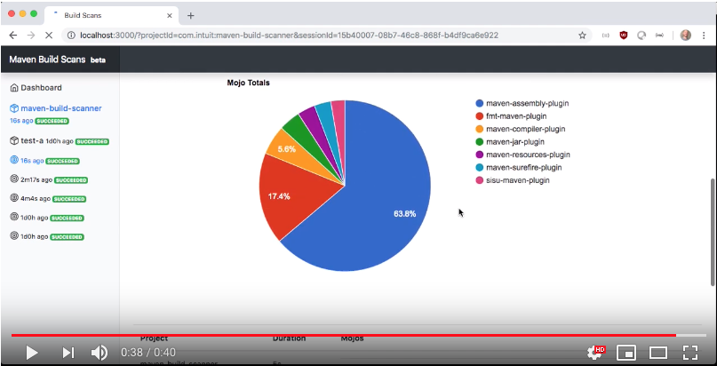

[](https://circleci.com/gh/intuit/maven-build-scanner)

# Maven Build Scanner

*Know your build - so you can make it faster*

## What Is Maven Build Scanner?

Maven Build Scanner is a tool that hooks into Maven builds and produces reports and charts that breakdown the time Maven
spends doing different tasks. These reports provide insights into your builds that can be used to tune it.

It's been designed to work with large and complex builds; ones with hundreds of modules and plugins.

At Intuit it helped take a 40m build run by hundreds of developers every day and reduce it to 4m - a 10x reduction.
[Read a blog post on the techniques that saved all this time](https://medium.com/@alex_collins/10x-faster-maven-builds-at-intuit-5b7bb60c65e6).

> (30m of engineering time) * (several hundred engineers) * (every working day for 5 years) * (some dollar amount) = (a
> LOT of money saved)

### Screenshot



### Video

[](https://www.youtube.com/watch?v=2tB63Wer-4E)

## How Do I Use It?

Install the following:

* Java
* Maven
* Docker

```bash
# run a mongo database
docker run -d --rm -p 27017:27017 --name mongo mongo
# run the web server
docker run -d --rm -p 3000:3000 -e MONGO_DB_HOST=host.docker.internal --name maven-build-scanner-server alexcollinsintuit/maven-build-scanner-server
```

Edit `~/.m2/settings.xml` and add the following profile:

```xml

<settings xmlns="http://maven.apache.org/SETTINGS/1.0.0"
          xmlns:xsi="http://www.w3.org/2001/XMLSchema-instance"
          xsi:schemaLocation="http://maven.apache.org/SETTINGS/1.0.0
                      http://maven.apache.org/xsd/settings-1.0.0.xsd">

    <activeProfiles>
        <activeProfile>github</activeProfile>
    </activeProfiles>

    <profiles>
        <profile>
            <id>github</id>
            <repositories>
                <repository>
                    <id>central</id>
                    <url>https://repo1.maven.org/maven2</url>
                </repository>
                <repository>
                    <id>github</id>
                    <url>https://maven.pkg.github.com/intuit/maven-build-scanner</url>
                    <snapshots>
                        <enabled>true</enabled>
                    </snapshots>
                </repository>
            </repositories>
        </profile>
    </profiles>

</settings>
```

Edit your `pom.xml` and add the following:

```bash
```

```bash
# Create your first scan:
mvn install
```

View your first scan at <http://localhost:3000>. The page will show:

* A timeline of the build, so you can see how effective concurrency is being used.
* A pie chart showing the Maven plugins that took the longest.
* A module-by-module breakdown of tasks.
* Links to reports on previous builds.

## Uninstall

```bash
output="$(mvn help:evaluate -Dexpression=maven.home -DforceStdout -q)/lib/ext/maven-build-scanner-jar-with-dependencies.jar"
rm -f $output
docker rm --force maven-build-scanner-server
docker rm --force mongo
```